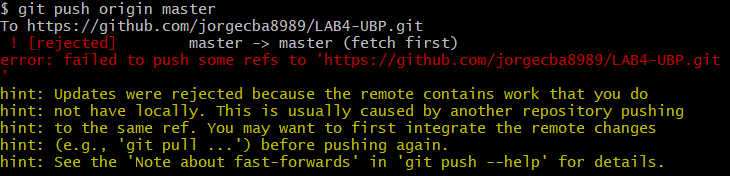
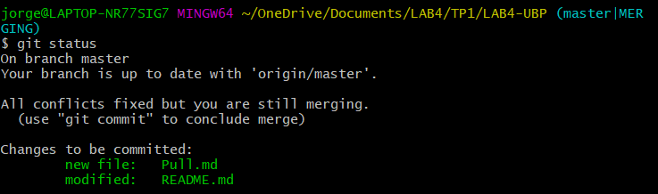

# SistemaControlVersiones

Para acceder al Tp de LabIV, ingresar al link de abajo:
**TP1** (https://github.com/jorgecba8989/LAB4-UBP#jorgecba8989)

### __4) Familiarizarse con el concepto de Pull Request__

* Crear un branch local y agregar cambios a dicho branch.

 

* Subir el cambio a dicho branch y crear un pull request.

 

* Completar el proceso de revisión en github y mergear el PR al branch master.

 

 

### __5) Mergear código con conflictos__

Ya una vez clonado y modificado el archivo CV.md, paso a realizar....
* Intentar subir el cambio, haciendo un commit y push. Mostrar el error que se obtiene.

 

* Hacer pull y mergear el código (solo texto por ahora), mostrar la herramienta de mergeo como luce.

 

 
